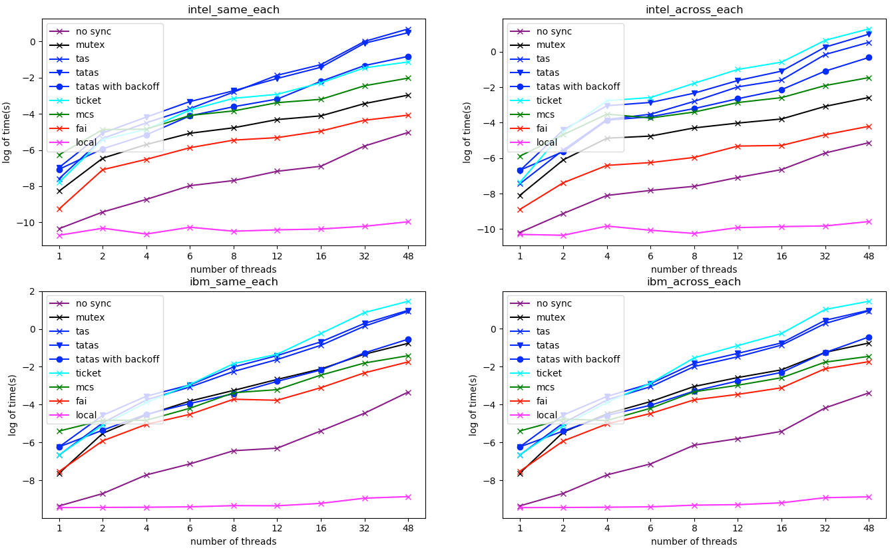
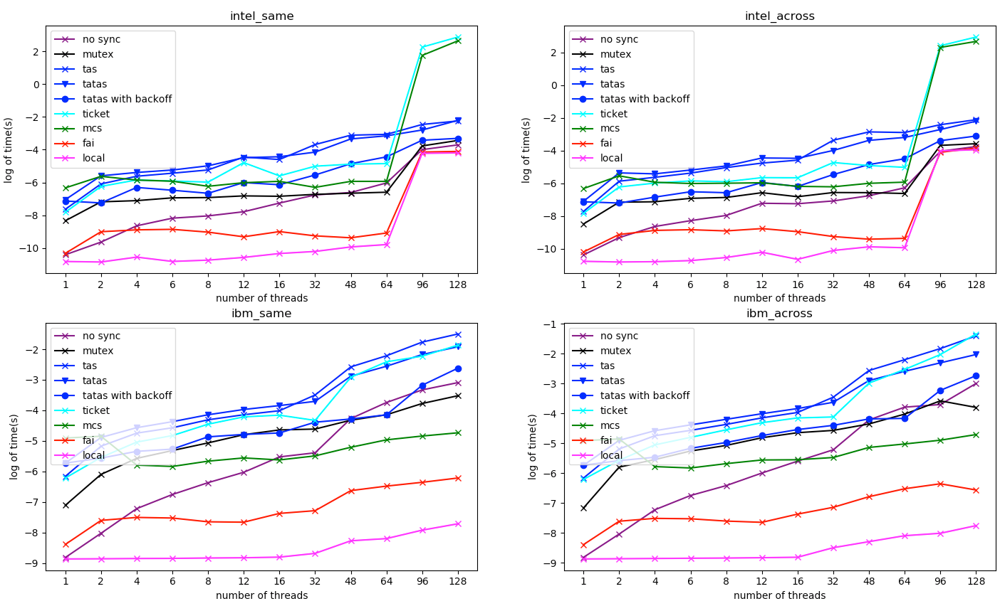

## Intro
This is a simple experiment for testing the spent time and fairness for different spinlocks in multithreaded programs including:
    - mutex
    - test and set (tas)
    - test and test and set (tatas)
    - test and test and set with backoff
    - ticket lock
    - MCS lock
    - Intel TSX's transactional memory usage (hardware lock elision, hle)
Multiple threads contends for the lock and increment a shared counter. The experiment consists of two sub-experiments:
    1. Experiment 1
        1.1 **Each** thread increments the shared counter i times (testing fairness);
        1.2 All the threads contend to increment the shared counter until the counter reaches a value(for a **total** of i times)
    2. Experiment 2
        - compare the intel TSX's hle and tatas with backoff. 

## Build
build executable exp1 for experiment 1

    make 

or

    make .exp1

usage:

    ./exp1 -t [thread_num] -i [i] -c [processor_num]  -m [mode] -o [output_dir] -n [repeat times] -d -s

- d means debug, so it will output the stat to stdout;
- s means "same socket", so threads will tend to be on the same physical socket if possible. 

build executable `exp2` for experiment 2 (only for intel machine):

    make .exp2

The usage for exp2 is similar(the only difference is that there are no mode and output option; the spent time will be printed on the stdout). 

## Results
To plot the timing result, you need the following python packpage:
- `numpy`
- `matplotlib`

then type

    python plot.py -p [platform1,platform2,...] -m [mode] -r [subplot rows] -c [subplot columns]

- mode means which experiment to show. 0 for 1.1, 1 for 1.2, and 2 for hle vs. tatas with backoff. 
- an example usage: 
    `python plot.py -p intel_same,intel_across,ibm_same,ibm_across -r 2 -c 2 -m 0`

### My Resutls
- the following platform info. is obtained via `lscpu` and `uname`.
- the number of vCPUs used is 36.
- the ibm machine
    - architecture: ppc64
    - total vCPUs: 160, 20 sockets
    - Cache line size: 
        - L1: 64K 
        - L2: 512K 
        - L3: 8192K
- the intel x86 machine
    - architecture: x86_64
    - total vCPUs: 72, 2 sockets
    - Cache line size:
        - L1: 32K
        - L2: 256K 
        - L3: 46080K

### Experiment 1.1

### Experiment 1.2

## Notes
- A short report is in `report.pdf`.
- To exploit the resources, I bind threads to (virtual) cores and enhance threads' priorities as processes; 
- The experiment is done on Intel x86 and IBM ppc64; to get the IBM version, open the `exp1.cpp` file and uncomment `#define IBM`;
- For better performance during spinning, I use `_mm_pause()` for intel x86 (it needs the header `immintrin.h`).
- IBM's Power series has a weaker memory consistency model, which may reorder lock acquisition and critical session's code. To avoid this, I use a compiler built-in `lwsync` provided by the IBM architecture. For further info, see [https://www.cs.rochester.edu/u/sandhya/csc458/](https://www.cs.rochester.edu/u/sandhya/csc458/)  

## Reference
- My code is based on: [https://www.cs.rochester.edu/u/scott/papers/1990_TR342.pdf](https://www.cs.rochester.edu/u/scott/papers/1990_TR342.pdf)
- IBM's Power Series Memory Consistency Model: [https://www.cs.rochester.edu/u/sandhya/csc458/](https://www.cs.rochester.edu/u/sandhya/csc458/)